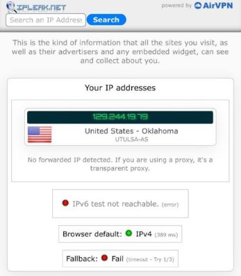
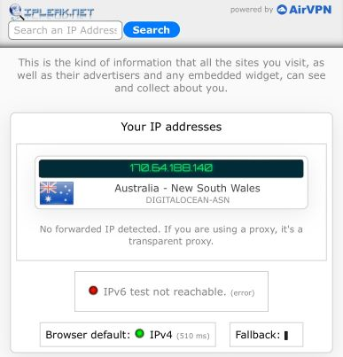
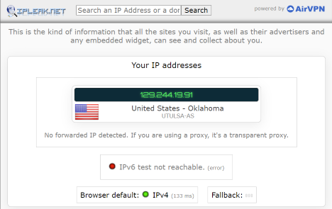
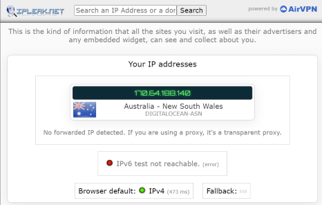
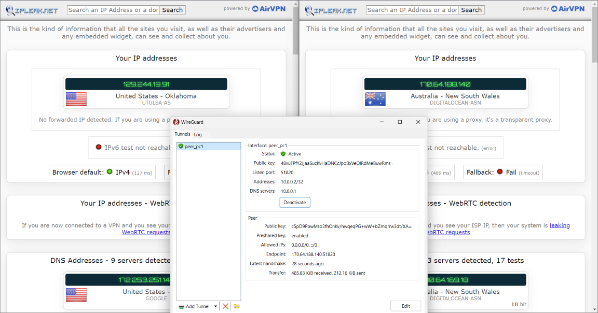

# Project 3 - "Wireguard VPN using Docker Droplet"

### System Administration Fall 2023

### Zack Mattie

## Wireguard VPN Installation using Docker on Digital Ocean Droplet

### Part 1
- The first step to this overall project is to create a Digital Ocean account. This does require credit card information, but nothing will be billed to you. Digital Ocean (DO) gives $200 credit for 2 months with a new account

- After creating an account and entering credit information, I chose the "Droplet" menu on the lefthand side of the dashboard.

- This prompts a creation of a new droplet. I selected Sydney, Australia as the data center. The droplet creation for this project requires Ubuntu 20.04.4 LTS operating system. I chose the most basic data plan with most basic CPU; this results in $4/month plan. 

- I make sure not to add any additional costs and go on ahead and confirm the set up of the droplet. This also requires a password or SSH key implementation for root access. The SSH key is more secure, therefore, the preferred option.

- To create an SSH key, I open up the terminal on my local host and type in the command `ssh-keygen` then enter through the prompts, not worrying about setting a passphrase. Once that finishes creating the key, I copy it to my clipboard for an easy copy and paste by using the command `cat ~/.ssh/id_rsa.pub`. I can Ctrl+V the SSH key in the respective space on Digital Ocean. This completes the creation of a droplet.

### Part 2
- The virtual server begins running automatically. The first thing to do is click on "Console" in the top right on the droplet. This launches a terminal window that automatically connects to the droplet Ubuntu server.

- Once a terminal is accessible, run the following commands:
    - `mkdir -p ~/wireguard/`
    - `mkdir -p ~/wireguard/config/`, 
    - `nano ~/wireguard/docker-compose.yml`

- This will create a directory path of /wireguard/config/ with a file inside /wireguard/ called "docker-compose.yml.

- The last command will open a nano window to type in the content of the .yml file. I copy and pasted the code found below:
```
version: '3.8'
services:
  wireguard:
    container_name: wireguard
    image: linuxserver/wireguard
    environment:
      - PUID=1000
      - PGID=1000
      - TZ=Asia/Hong_Kong
      - SERVERURL=1.2.3.4
      - SERVERPORT=51820
      - PEERS=pc1,pc2,phone1
      - PEERDNS=auto
      - INTERNAL_SUBNET=10.0.0.0
    ports:
      - 51820:51820/udp
    volumes:
      - type: bind
        source: ./config/
        target: /config/
      - type: bind
        source: /lib/modules
        target: /lib/modules
    restart: always
    cap_add:
      - NET_ADMIN
      - SYS_MODULE
    sysctls:
      - net.ipv4.conf.all.src_valid_mark=1
```
- Then it is important to change the relative information based on my circumstance such as timezone, serverurl, and peers. 

- To begin, I change the line from `TZ=Asia/Hong_Kong` to `TZ=America/Chicago`. Then I change the SERVERURL. This is the server IP address which can be found on DigitalOcean's dashboard of the droplet. For my droplet, the IP address is 170.64.188.140.

- I change the line from `SERVERURL=1.2.3.4` to `SERVERURL=170.64.188.140`. The last line to update is `PEERS=pc1,pc2,phone1`. This is actually okay for my project, but others may need to change it to fit their needs. 

- The line `SERVERPORT=51820` has the port 51820 as the default. This can be changed to 80 which is usually not blocked on public WiFi. I decided to leave this alone for the purpose of this project to make it even simpler.

### Part 3
- Now that the framework has been set up, it's time to download the required software. First on the server terminal, install tools with `sudo apt install apt-transport-https ca-certificates curl software-properties-common -y` then add a docker key with `curl -fsSL https://download.docker.com/linux/ubuntu/gpg | sudo apt-key add -`.

- Next I add the correct docker repository with 
```
sudo add-apt-repository \
   "deb [arch=amd64] https://download.docker.com/linux/ubuntu \
   $(lsb_release -cs) \
   stable"
```
- Now it's important to switch this correct repository with `apt-cache policy docker-ce`

- Finally, I install docker using the command `sudo apt install docker-ce -y`

- I exit and reload the console to make sure all settings are updated. Then install docker-compose with `sudo curl -L "https://github.com/docker/compose/releases/download/1.27.4/docker-compose-$(uname -s)-$(uname -m)" -o /usr/local/bin/docker-compose`.

- Lastly, I set the correct permission with `sudo chmod +x /usr/local/bin/docker-compose`.

### Part 4
- Now that the docker is all installed and set up, I try to start docker with changing directory into /wireguard using `cd /wireguard` then running `docker-compose up -d`.

- This command may take a few seconds. It creates a docker container and starts Wireguard in the server. I see "Creating wireguard... done!" which tells me it's ready for the next step.

- The last command to run is `docker-compose logs -f wireguard`. This prints a QR code for each peer that was specified in the .yml file in previous steps. Since I have peers being pc1, pc2, and phone1...I have three QR codes that print. The QR code is only usable for phone1 so let's start with that

- I have an iPhone so I downloaded the Wireguard app from the AppStore. I travel to ipleak.net and it'll show my current IP. This is shown below.



- Then I open up the Wireguard app and add a tunnel. This pulls up a camera to scan the QR code shown on the droplet terminal. I travel back to ipleak.net and refresh the screen. A screenshot is shown below. The IP address is the same as the SERVERURL previously specified in the .YML file. This is the public IP address that the droplet is running on, so this means it's working correctly.



### Part 5
- The last step to this project is to download Wireguard on the local host PC and try it the VPN on there, not just the phone. To begin, I exit the QR code command using "Ctrl+C" and then change directory into the following path `wireguard/config/peer_pc1`. There are several files in this directory including `peer_pc1.config`. Run the command `nano peer_pc1.config` and then highlight and copy all content in this file. This is shown below with the private key redacted:
```
[Interface]
Address = 10.0.0.2
PrivateKey = [REDACTED]
ListenPort = 51820
DNS = 10.0.0.1

[Peer]
PublicKey = c5pD9PbwMso3fhOnKv/nwqeqPG+wW+bZmqrrw3dt/XA=
PresharedKey = BvhGD9N7CuFJ7Mz0soHirHxZIyYQQVs6935snXvbr2Q=
Endpoint = 170.64.188.140:51820
AllowedIPs = 0.0.0.0/0, ::/0
```
- This entire block of text can be copied onto a file on the local host. I make a file called `peer_pc1.config` on my Downloads folder for ease of use. This will be imported later in the Wireguard application on the PC.

- Next I travel to ipleak.net on the local host PC to see the current IP address. This is shown below.



- Lastly, I open the Wireguard app on the local host PC and click `open tunnel from file` which is when I select the `peer_pc1.config` file previously mentioned that's saved in /Downloads. Once imported, I click the "Activate" button and my local host immediately switches from WiFi to VPN shown in the task bar with a notification from Wireguard. I go back to my web browser and refresh the ipleak.net page. The screenshot below shows the new IP address. Once again this address matches the address from the droplet and specified in the .yml file meaning it is successful.



### Conclusion
- This is a wonderful project to show how easy it is to set up a server that can perform as a cheap VPN to a database that's specified by the user. Most VPN services are expensive with the cheap ones limiting the options, especially the ability to choose the location. This is not only rather easy with only a few steps, but can be used for multiple devices and is quite cheap for only $4/month essentially. 




